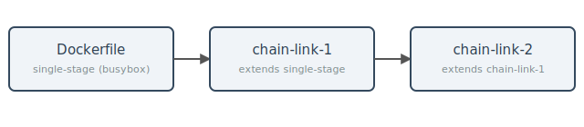

# Image Workflow

Template repository demonstrating a multi-arch Docker image CI/CD workflow with GitHub Actions.

Source: [github.com/its-me/image-workflow](https://github.com/its-me/image-workflow)

## Images

- `X.Y.Z`, `latest` — Standalone single-stage image, built from busybox ([Dockerfile](Dockerfile))
- `chain-link-1-X.Y.Z`, `chain-link-1` — First link of a multi-stage chain, extends the single-stage image ([Dockerfile.chain-link-1](Dockerfile.chain-link-1))
- `chain-link-2-X.Y.Z`, `chain-link-2` — Second link, extends `chain-link-1` ([Dockerfile.chain-link-2](Dockerfile.chain-link-2))
- `simple-X.Y.Z`, `simple` — Minimal single-platform build, extends the single-stage image ([Dockerfile.simple](Dockerfile.simple))

## Platforms

`X.Y.Z`, `latest`, `chain-*`: `linux/amd64` · `linux/arm64` · `linux/arm/v7` · `linux/arm/v6` · `linux/386` · `linux/ppc64le` · `linux/s390x` · `linux/riscv64`

`simple*`: `linux/amd64` only

## Registries

- [GitHub Container Registry](https://ghcr.io/its-me/workflow)
- [Docker Hub](https://hub.docker.com/r/1tsme/workflow)
- [Quay.io](https://quay.io/repository/itsme/workflow)
